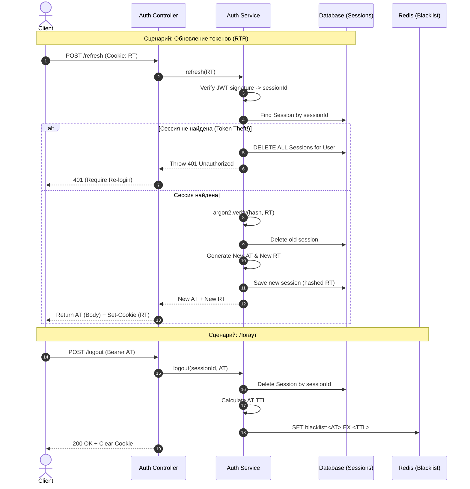

```markdown
title: Документация микросервиса авторизации (Auth Service)
date: 2026-04-05
tags:
  - architecture
  - nestjs
  - auth
  - microservices
  - security
aliases:
  - Auth Service
---
```

# 🛡️ Auth Service: Эталонная Архитектура и ТЗ

> [!abstract] 🤖 Контекст для ИИ-агента (System Instruction)
> Ты — Senior Backend Developer и Архитектор. Этот документ является твоей строгой спецификацией для реализации микросервиса авторизации на базе **NestJS**. Твоя задача: писать код, строго следуя описанным ниже структурам данных, DTO, паттернам безопасности (RTR, Redis Blacklist) и алгоритмам бизнес-логики. Используй `class-validator`, `Dependency Injection`, паттерн Repository и стандартные подходы NestJS (Guards, Strategies, Decorators).

## 🌟 1. Архитектурные стандарты безопасности (Gold Standards)

Данный сервис реализует наилучшие современные практики безопасности:

1. **Разделение токенов (Access / Refresh):**
   - **Access Token (AT):** Stateless JWT, короткоживущий (например, 15 минут). Передается в теле ответа, используется клиентом через заголовок `Authorization: Bearer`.
   - **Refresh Token (RT):** Stateful (отслеживается в БД), долгоживущий (7-30 дней). Передается Web-клиентам строго через `HttpOnly`, `Secure`, `SameSite=Strict` Cookie для защиты от XSS-атак.
2. **Refresh Token Rotation (RTR):** При каждом обновлении токенов (через `/refresh`) старый RT инвалидируется, и выдается совершенно новая пара (AT + RT). 
3. **Обнаружение кражи токена (Reuse Detection):** Если система фиксирует попытку использования уже ротированного (использованного) Refresh-токена, она помечает сессию как скомпрометированную и **отзывает все сессии (токены)** данного пользователя.
4. **Криптография (Argon2):** Пароли и Refresh-токены хранятся в БД **исключительно в виде хэшей**. Для хэширования используется алгоритм **Argon2** (надежнее bcrypt).
5. **Hard Invalidation (Redis Blacklist):** При логауте, помимо удаления сессии из БД, текущий Access Token заносится в **Redis Blacklist** с TTL (Time-To-Live), равным оставшемуся времени жизни токена.

---

## 🗄️ 2. Схема Данных (Database Models)

*Для ИИ-агента: используй эту структуру для создания схемы Prisma ORM или сущностей TypeORM.*

### 👤 `User` (Пользователь)
| Поле | Тип | Описание |
| :--- | :--- | :--- |
| `id` | UUID | Primary Key |
| `email` | String | Уникальный email (Indexed, Lowercase) |
| `passwordHash` | String | Хэш пароля (Argon2) |
| `roles` | String[] | Массив ролей (по умолчанию `['USER']`) |
| `createdAt` | DateTime | Время создания аккаунта |

### 📱 `Session` (Активные сессии / Устройства)
Позволяет пользователю быть авторизованным с нескольких устройств одновременно (Телефон, ПК).
| Поле | Тип | Описание |
| :--- | :--- | :--- |
| `id` | UUID | Primary Key (Он же `sessionId`, зашитый в payload токенов) |
| `userId` | UUID | Foreign Key к таблице `User` (Cascade Delete) |
| `refreshTokenHash`| String | Хэш текущего Refresh Token (Argon2) |
| `ip` | String | IP-адрес запроса (для безопасности) |
| `userAgent` | String | Данные об устройстве / браузере |
| `expiresAt` | DateTime | Время протухания сессии |

---

## 📦 3. Data Transfer Objects (DTO) и Payload

*Для ИИ-агента: Все входящие данные должны строго валидироваться глобальным `ValidationPipe`.*

### Входящие запросы (Requests)
```typescript
export class RegisterDto {
  @IsEmail({}, { message: 'Некорректный email' })
  email: string;

  @IsString()
  @MinLength(8, { message: 'Пароль должен быть от 8 символов' })
  // Опционально: @Matches() для проверки спецсимволов и цифр
  password: string;
}

export class LoginDto {
  @IsEmail()
  email: string;

  @IsString()
  @IsNotEmpty()
  password: string;
}
```

### Структуры JWT (Payloads)
```typescript
// То, что зашивается внутрь токенов
export interface JwtPayload {
  sub: string;       // userId
  email: string;
  roles: string[];
  sessionId: string; // ID сессии в БД (Крайне важно для логаута)
}
```

### Ответы (Responses)
```typescript
export class AuthResponseDto {
  accessToken: string;
  // refreshToken НЕ отдается в теле для Web (он идет в Cookie). 
  // Отдается в теле только если клиент - мобильное приложение.
  user: {
    id: string;
    email: string;
    roles: string[];
  };
}
```

---

## ⚙️ 4. Детальная бизнес-логика (Пошаговые алгоритмы)

> [!warning] Внимание ИИ-агенту
> Реализуй методы `AuthService` строго по этим шагам. В целях безопасности никогда не уточняй причину ошибки при логине (используй общие фразы: "Неверный email или пароль").

### 4.1. Регистрация (`POST /auth/signup`)
1. Проверить существование `email` в БД. Если есть -> `409 ConflictException`.
2. Захэшировать пароль через `argon2.hash()`.
3. Сохранить пользователя в БД (`User`).
4. Сгенерировать новый `sessionId` (UUID).
5. Сгенерировать Access и Refresh токены (подписать через `JwtService`).
6. Захэшировать полученный Refresh Token (`argon2.hash`).
7. Сохранить новую запись в `Session` (`userId`, `sessionId`, `refreshTokenHash`, `ip`, `userAgent`).
8. В контроллере: установить RT в `HttpOnly Cookie`. Вернуть AT и данные юзера в теле.

### 4.2. Авторизация (`POST /auth/signin`)
1. Найти `User` по `email`. Если нет -> `401 UnauthorizedException`.
2. Сверить пароли: `argon2.verify(dbHash, password)`. Если false -> `401 UnauthorizedException`.
3. Сгенерировать новый `sessionId` (UUID).
4. Сгенерировать новую пару токенов (AT + RT).
5. Захэшировать новый RT.
6. Сохранить **новую** запись в `Session` (создается новая сессия для нового устройства).
7. Установить Cookie и вернуть ответ.

### 4.3. Ротация токенов (`POST /auth/refresh`) — *КРИТИЧЕСКИЙ УЗЕЛ*
1. Извлечь сырой `refreshToken` из Cookie.
2. Верифицировать подпись токена (`JwtService.verify`). Извлечь `userId` и `sessionId` из payload. Если протух/невалиден -> `401`.
3. Найти сессию: `SELECT * FROM Session WHERE id = sessionId`.
4. **[Reuse Detection]:** Если сессия **НЕ НАЙДЕНА** (но токен криптографически валиден):
   - Значит, токен был украден и уже использован злоумышленником (или легитимным юзером ранее).
   - **Действие:** Удалить **ВСЕ** сессии пользователя (`DELETE FROM Session WHERE userId = userId`).
   - Выбросить `401 UnauthorizedException`.
5. Если сессия найдена:
   - Сверить сырой токен с хэшем из БД: `argon2.verify(session.refreshTokenHash, refreshToken)`. Если false -> `401`.
   - **Ротация:** Удалить старую сессию из БД по `sessionId`.
   - Сгенерировать новый `sessionId`, новые AT и RT.
   - Захэшировать новый RT, сохранить как новую сессию в БД.
   - Установить новую Cookie и вернуть новый AT.

### 4.4. Логаут (`POST /auth/logout`)
1. Запрос защищен `JwtAuthGuard`.
2. Извлечь `sessionId` и сам `accessToken` из запроса.
3. Удалить сессию из БД (`DELETE FROM Session WHERE id = sessionId`).
4. **[Redis Blacklisting]:** 
   - Вычислить оставшееся время жизни AT: `TTL = exp - current_time`.
   - Поместить `accessToken` в Redis: `SET blacklist:<token> "revoked" EX <TTL>`.
5. В контроллере: очистить Cookie (`Max-Age=0`).

### 4.5. Выход со всех устройств (`POST /auth/logout-all`)
1. Запрос защищен `JwtAuthGuard`.
2. Извлечь `userId` из запроса.
3. Удалить **все** сессии пользователя: `DELETE FROM Session WHERE userId = userId`.
4. Занести текущий `accessToken` в Redis Blacklist.
5. Очистить Cookie.

---

## 📊 5. Диаграмма потока (RTR и Breach Detection)

*В Obsidian диаграмма отрендерится автоматически благодаря интеграции Mermaid.*



---

## 🛠️ 6. Инструкции по реализации для NestJS (Чек-лист ИИ)

*Агент, при написании кода убедись, что выполнил следующие пункты:*

- [ ] **Модули:** Установи и используй `@nestjs/passport`, `@nestjs/jwt`, `passport-jwt`, `argon2`, `cookie-parser`. Для Redis используй `@nestjs/cache-manager` или `ioredis`.
- [ ] **Конфигурация:** Все секреты (`JWT_ACCESS_SECRET`, `JWT_REFRESH_SECRET`) и сроки жизни (`15m`, `7d`) получай строго через `ConfigService`. Не хардкодить!
- [ ] **Глобальный Guard:** Создай `JwtAuthGuard` (наследует `AuthGuard('jwt')`) и сделай его глобальным в `AppModule` (`APP_GUARD`).
- [ ] **Декоратор @Public():** Реализуй декоратор для обхода глобального Guard на эндпоинтах `/signup`, `/signin`, `/refresh`.
- [ ] **JwtStrategy (Access):** В методе `validate(payload)` **обязательно** извлекай сырой токен из Request и проверяй его наличие в Redis Blacklist. Если он там есть -> `throw new UnauthorizedException()`.
- [ ] **Cookie Extractor:** Создай логику для извлечения Refresh токена из Cookie для эндпоинта `/refresh`.
- [ ] **Кастомный декоратор @CurrentUser():** Для удобного извлечения `userId`, `email` и `sessionId` из `req.user` внутри контроллеров.
- [ ] **Ответы Cookies:** В `AuthController` используй `@Res({ passthrough: true }) res: Response` для установки HttpOnly cookies.
